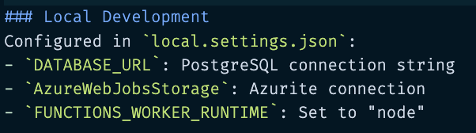

## Specs
- Copilot CLI
- Claude Sonnet 4.5

## Likes
- Actually recommends azure functions & azd extensions
- When prompt was structured a certain way, went through planning doc automatically
- Was useful when explicitly told how it could help in the rest of the dev cycle, including next steps

## Dislikes
- Was missing script to spin up local db emulator, had to explicitly ask for that.
- Local setup description did not have deep knowledge about how Azure Functions extension could help us here.

## Improvements
- Next steps for local development guide explains how to set up the local.settings.json to run with local emulators.  Azure Functions basically does this already, it would be nice if Copilot already knew this and pushed users to leverage our tools instead of asking the user to do this manually.

We could give the user the option to spin up using docker-compose or leveraging the functions extension, their choice could affect the kind of next steps they would receive.

