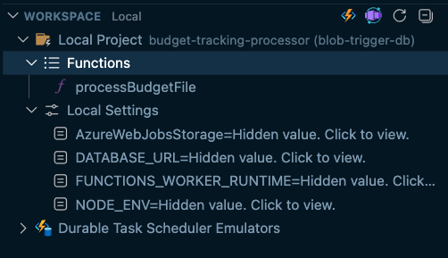

- if we detect a storage trigger, we should recommend the storage extension so that we can monitor uploads through the azurite emulator

- Not sure if the autoconfigured task debug solution worked, will need to verify better next time.  We could definitely expose a more deterministic approach for this if we want it to be more reliable

- It would be cool if we could automatically attach to the cosmos db local connection through lm tool or mcp

- error with the sql migration query, only known by inspecting the container logs, would be good to steer copilot to check this as part of the potential troubleshooting options
  - **FIXED**: Migration was generating `IF NOT EXISTS` with `ADD CONSTRAINT` which PostgreSQL doesn't support. Changed to raw SQL. See `migration-fix-summary.md` and `transcript.md`